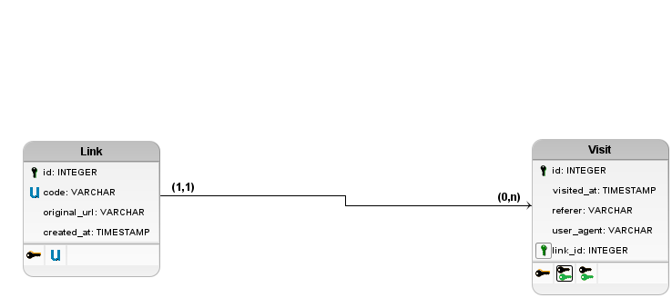

# URL Shortener

A URL shortener lets the user submit an original link and receive a shorter one, useful for posts, for example, since the original link is too long.

## Data model

## Use cases

- **Owner** — creates a short link from an original URL — receives the generated short link
- **Visitor** — accesses the short link — the system records the visit and the visitor is redirected to the original site
- **Owner** — views the statistics of a link — receives the total number of clicks and the clicks per day
- **Owner** — lists the short links in the system — receives the list of available short links
